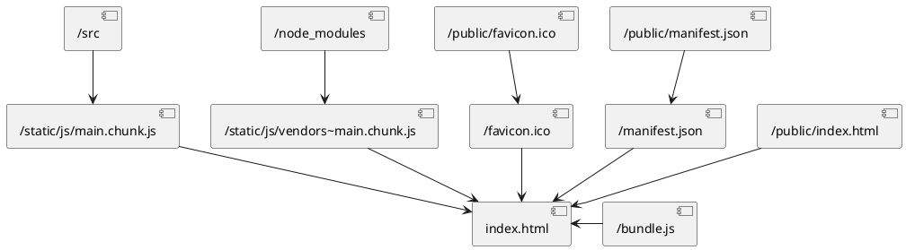

# Задание 9

## Какой-то заголовок

Курс по изучению react.js

Пример списка:

1. HTML
1. CSS
1. JS

### Ещё какой-то заголовок
Ниже пример *вставки кода*

```
menuBtn.addEventListener('click', function () {
    menu.classList.toggle("active")
});
```
### Полезные ссылки
[Тут](https://metanit.com/web/react/) полезная ссылка.


> тут цитата

Заголовок таблицы 1 | Заголовок таблицы 2
--------------------|-
строка 1            | строка 1
--------------------|-
строка 2            | строка 2


### Диаграмма запуска react приложения




# js-rpqgmy

[Edit on StackBlitz ⚡️](https://stackblitz.com/edit/js-rpqgmy)